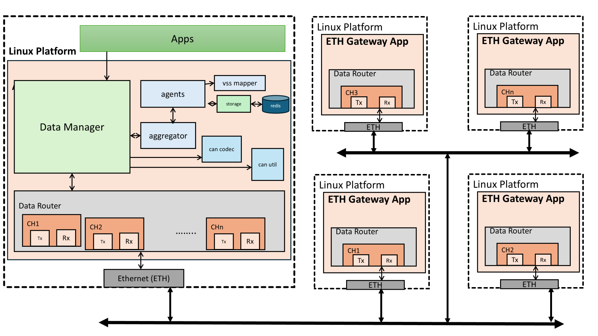

# Architecture Automotive 1722
Automotive 1722, how data is packed in IEEE packets with CAN frame using open1722 open-source framework, extracts the CAN frames and saved in data store.

## System architecture and communication
In below image, the data is communicated via ETH between two or more devices having with different destination MAC address and its data flow.

